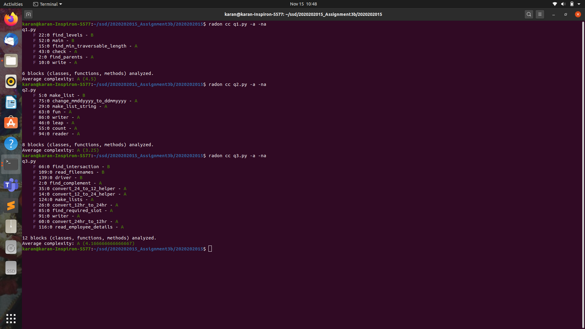

### Removed code outside functions and added it to different functions for correctly identifying Cyclomatic complexity.(In all questions) 
### Achieved A grade in all questions, Attached `ComplexityScreenshot.png` below and also in the repository/folder. 

# q1.py
 - ##### Removed line-number 49 to 52(of old file) and added 15 to 20(of new file):
   - made new function `find_min_traversable_length` for calculating min_length traversable
 - ##### Removed line-number 54 to 72 and added 22 to 41:
   - made new function `find_levels` to find list of levels from each employees 
 - ##### Removed line-number 73,74,75 and added 10 to 13:
   - made new function `write` to print desired details.
 - ##### Removed line-number 19 to 23 and added 43 to 49:
   - made new function `check` to check if leader is given as input. if no then calls `main` function.
 - ##### Added line-number 26 to 30 to new function `main`:
   - made `main` function to call all other functions.
# q2.py
 - ##### Removed line-number 81 to 96 and added 75 to 85:
   - made new function `change_mmddyyyy_to_ddmmyyyy` whose name is self explainable.
 - ##### Removed line-number 98 to 104 and added 86 to 93:
   - made new function `writer` to write desired output in the file.
 - ##### Removed line-number 75 to 78 and added 94 to 99:
   - made new function `reader` to read dates from file.
# q3.py
 - ##### Removed line-number 17 to 36 and added 14 to 24,29 to 32:
   - optimized code (made loop for handling both start and end and called `convert_12_to_24_helper` function)
   - added new function `convert_12_to_24_helper` to handle operations more efficiently.
 - ##### Removed line-number 39 to 44,46,48 to 81 and Added 60 to 63,35 to 57:
   - optimized code (made loop for handling both start and end and called `convert_24_to_12_helper` function)
   - added new function `convert_24_to_12_helper` to handle operations more efficiently.
 - ##### Removed line-number 109 to 114 and added 109 to 115:
   - made new function ` read_filenames` to read files and return `file_list`.
 - ##### Removed line number 116 to 124 and added 116 to 122:
   - made new function `read_employee_details` to read content of files from file_list and stored it's object form into e_list and returned it.
 - ##### Removed line-number 126 to 136 and added 124 to 137:
   - made new function `make_lists` to make lists like emp_names_list, dates_list,list_list.
 - ##### Added line 145 to 167 to new function `driver`:
   - It works as backbone of program and calls all other neccessary functions defined above.
   - It takes arguments returned from `make_lists` and calls `writer` function.
 - ##### Removed line-number 168 to 183 and added 91 to 107:
   - made new function `writer` to write desired output into file.
 - ##### Removed line-number 138 to 144 and added 168 to 177:
   - Optimized code and called `driver` function.

## Repository link: https://github.com/KaranBhut44/2020202015/tree/PartC
